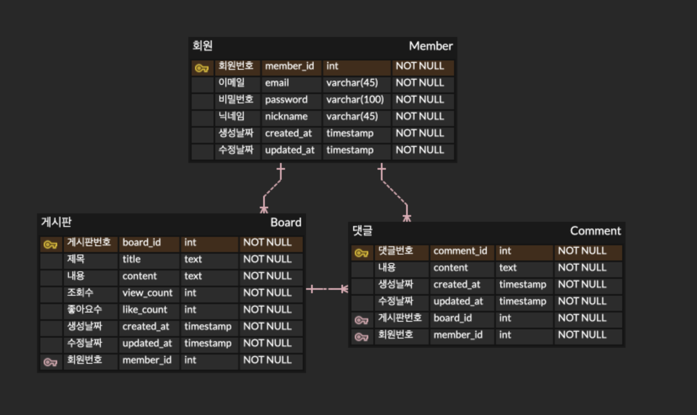
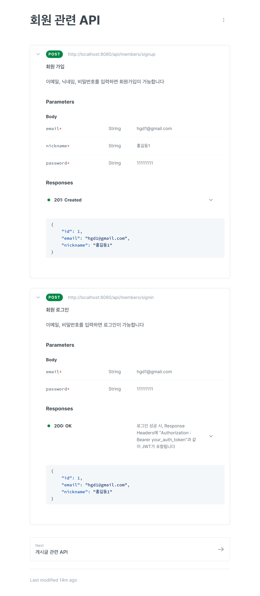

## ⭐️ wanted-pre-onboarding-backend
- 성명 : 이연수
- 기술 스택 : Java / Spring Boot
- 프로젝트 설명 : 원티드 프리온보딩 사전과제 RESTful 게시판
- 데모 영상 링크 : https://drive.google.com/file/d/16u0nW1IFfIm58wl0pblgzBUvJF9V4r6H/view?usp=drive_link

## 💻 프로젝트 주요 내용
### 사용자 관련 요청
- 사용자 회원가입
    - [POST요청] http://localhost:8080/api/members/signup
    - Request Body(JSON)로 이메일, 비밀번호, 닉네임을 받을 수 있어야한다
    - 이메일 조건 : @ 포함
    - 비밀번호 조건 : 8자 이상
    - 비밀번호는 암호화하여 저장된다
- 사용자 로그인
    - [POST요청] http://localhost:8080/api/members/signin
    - Request Body(JSON)로 이메일, 비밀번호를 받을 수 있어야한다
    - 이메일 조건 : @ 포함
    - 비밀번호 조건 : 8자 이상
    - 로그인이 정상적으로 완료되었을 경우, Response Header에 Access Token이 반환된다
    - 로그인이 정상적으로 완료되지않았을 경우, 
### 게시글 관련 요청 
- 게시글 생성
    - [POST요청] http://localhost:8080/api/boards
    - Request Body(JSON)로 제목, 내용을 받을 수 있어야한다
    - 회원만 게시글을 작성할 수 있도록 구현하였다
     → Request Header에 Authorization 값으로 로그인된 토큰을 보내주어야한다
    - 생성된 게시글은 제목, 내용, 조회수, 좋아요수를 필드로 갖는다
- 게시글 목록 조회
    - [GET요청] http://localhost:8080/api/boards
    - 회원이 아니더라도 게시글 조회는 가능하다
    - Pagenation으로 구현하였다
    - 페이지 사이즈는 20이며, request parameter로 페이지 번호를 설정할 수 있다
     ( 예시 ) ?page=2
- 특정 게시글 조회
    - [GET요청] http://localhost:8080/api/boards/{id}
    - 회원이 아니더라도 게시글 조회는 가능하다
    - 제목, 내용, 작성자, 조회수, 좋아요수, 생성날짜, 수정날짜, 해당 게시글의 모든 댓글을 Response로 갖는다
    - 특정 게시글 조회 시, viewCount를 1만큼 증가 시킨다
    - 댓글 조회는 게시글을 통해서만 가능하다
    - 댓글 조회 시, 내용, 작성자의 닉네임, 생성날짜, 수정날짜가 보이도록 하였다
    - 삭제된 댓글은 조회가 불가능하다
- 특정 게시글 수정
    - [PATCH요청] http://localhost:8080/api/boards/{id}
    - 게시글을 작성한 작성자만 수정 가능하도록 구현하였다
     → Request Header에 Authorization 값으로 로그인된 토큰을 보내주어야한다
    - 잘못된 요청을 할 경우, 401에러가 발생한다
- 특정 게시글 삭제
    - [DELETE요청] http://localhost:8080/api/boards/{id}
    - 게시글을 작성한 작성자만 삭제 가능하도록 구현하였다
     → Request Header에 Authorization 값으로 로그인된 토큰을 보내주어야한다
    - 잘못된 요청을 할 경우, 401에러가 발생한다
- 특정 게시글 좋아요
    - [POST요청] http://localhost:8080/api/boards/{id}/likes
    - 회원이 아니더라도 좋아요를 누를 수 있다
    - 클라이언트에서 좋아요를 한 번 누르면 못 누르도록 설정이 필요하다

### 댓글 관련 요청
- 댓글 생성
    - [POST요청] http://localhost:8080/api/comments
    - Request Body(JSON)로 게시글 아이디와 댓글 내용을 받을 수 있어야한다
    - 회원만 댓글을 작성할 수 있도록 구현하였다
     → Request Header에 Authorization 값으로 로그인된 토큰을 보내주어야한다
    - 생성된 댓글은 내용, 생성날짜, 수정날짜, 작성자, 게시물을 필드로 갖는다
- 댓글 수정
    - [PATCH요청] http://localhost:8080/api/comments/{id}
    - 댓글을 작성한 작성자만 수정 가능하도록 구현하였다
     → Request Header에 Authorization 값으로 로그인된 토큰을 보내주어야한다
    - 잘못된 요청을 할 경우, 401에러가 발생한다
- 댓글 삭제
    - [DELETE요청] http://localhost:8080/api/comments/{id}
    - 댓글을 작성한 작성자만 삭제 가능하도록 구현하였다
     → Request Header에 Authorization 값으로 로그인된 토큰을 보내주어야한다
    - 잘못된 요청을 할 경우, 401에러가 발생한다

## 📌 데이터베이스 테이블 구조

##  📑 API 명세
API 문서 링크 : https://dustn7197s-organization.gitbook.io/wanted-pre-onboarding-backend/

